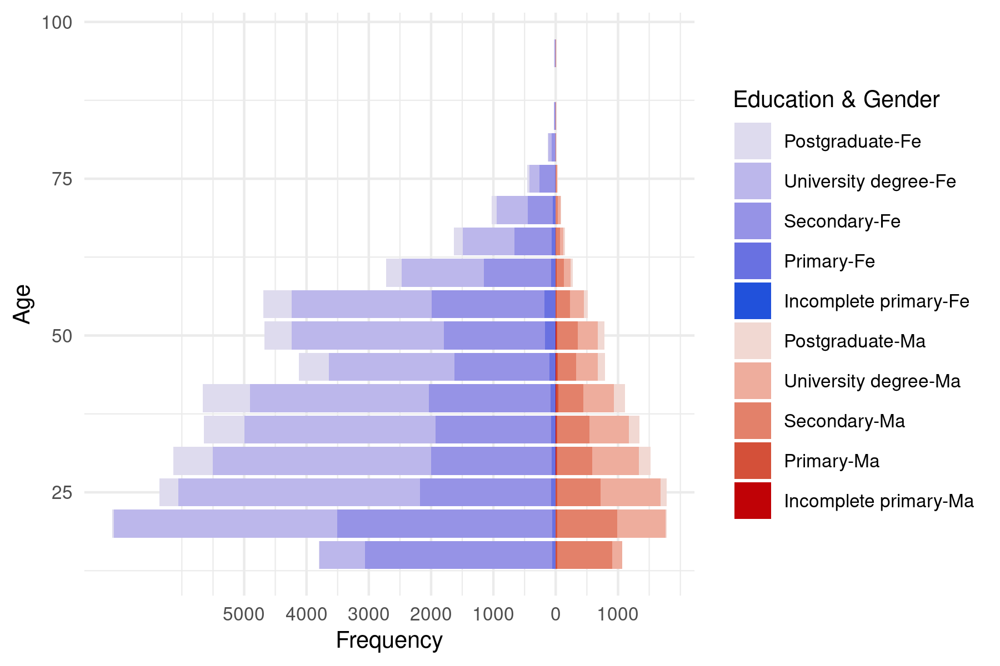

```{r echo=FALSE,warning=FALSE}
# Load libraries
library(knitr)
library(png)
library(tidyverse)
library(gridExtra)
library(ggpubr)
library(cowplot)


source('../scripts/settings.R')

# Theme settings
theme_set(theme_bw())
percent_labeller = scales::label_percent()
numberer=scales::label_number(accuracy=1)


```


```{r echo=FALSE,warning=FALSE,include=FALSE}
# Load preprocessing statistics
file.stats = paste0('../data/SWOW/output/preprocessData.stats.',release,'.csv')
X.stats = read_table(file.stats)
```

## Participants
```{r echo=FALSE,warning=FALSE}
file.pp = paste0('../data/SWOW/processed/SWOW-RP.PP.',release,'.csv')
PP = read_csv(file.pp) %>% as_tibble()
nPP = PP %>% nrow()
gender = PP %>% group_by(gender) %>% tally() %>% mutate(pct = n/nPP*100)
pctMale = gender %>% filter(gender=='Ma') %>% pull(pct) %>% round(1)
pctFemale = gender %>% filter(gender=='Fe') %>% pull(pct) %>% round(1)
pctX = gender %>% filter(gender=='X') %>% pull(pct) %>% round(1)
age = PP %>% summarise(m = round(mean(age,na.rm = T),1),
                       sd = round(sd(age,na.rm=T),1),
                       minAge = round(min(age),1),
                       maxAge = round(max(age),1))

pct.Removed = round(100 - PP %>% filter(status=='Valid') %>% nrow() / PP %>% nrow() *100,1)
table(PP$status)

```
There were `r nPP` 
participants in total (`r pctMale`% males, `r pctFemale`% females and `r pctX`% other) with an average
age of `r age$m` (SD = `r age$sd`, min = `r age$minAge`, max = `r age$maxAge`).
Participants were excluded based on several demographic and response criteria.
First, only participants aged 16 and older were retained. 
Next, participants responses that provided the same response to several cues in the list
were excluded. Participants who indicated over 70% of words as either unknown or missing 
were excluded. Finally, participants who responded with over 
`r round(criteria.Ngram*100)`% of multiword phrases or where fewer than 
`r round(criteria.Spanish*100)`% of words were not in a Spanish word list were 
also excluded. The total number of excluded participants amounted to 
`r pct.Removed `% of the original sample.

### Demographic details
Further details about the retained participants sample are shown in Figure 1 and 2.
Figure 1 shows the geolocation of participants in Uruguay and Argentina, together relative to the distribution worldwide. Most participants spoke the Rioplatense variant (Argentina: XX%, Uruguay, YY%), followed by Cordobes (XX%) and Nor-oriental Guarani (XX%). The majority of participants were in Argentina or Uruguay at the moment of testing, with the largest proportion outside of these countries in XX (X%) and YY (Y%).


```{r echo=FALSE,fig.align = 'center',out.width="25%",fig.show='hold',fig.cap='My caption'}
include_graphics('../figures/participantGeolocation.png',)
```
Figure 2 shows the breakdown interaction between age, gender and education.

<div>
<div class='row'>
<div class='col-lg-2'>
&nbsp;
</div>
<div class='col-lg-8' style='max-width:400px;'>
  
  </div>
</div>
</div>


## Cues
```{r echo=FALSE}
file.cues = paste0('../data/SWOW/output/centrality/cueStats.SWOW-RP.R123.',release,'.csv')
X.cues = read_csv(file.cues) %>% as_tibble()

cues.stats = X.cues %>% summarise(min.n = min(N),max.n = max(N),
                     min.coverage = min(coverage),
                     max.coverage = max(coverage),
                     m.coverage = mean(coverage),
                     min.unknown = min(unknown),
                     max.unknown = max(unknown),
                     m.unknown = mean(unknown),
                     sd.unknown = sd(unknown),
                     m.xR2 = mean(xR2),sd.XR2 = sd(xR2),
                     m.xR3 = mean(xR3),sd.XR3 = sd(xR3))

nProper = sum(stringr::str_to_lower(X.cues$cue) != X.cues$cue)
```

The dataset consists of `r X.cues %>% nrow()` cue words and included `r nProper` 
proper nouns.

## Responses

```{r}
file.swow = paste0('../data/SWOW/processed/SWOW-RP.spellchecked.',
                            release,'.csv')
X = read.csv(file.swow, stringsAsFactors = FALSE,encoding = 'UTF-8') %>% 
  as_tibble()
nResponses = nrow(X)
```


### Missing and unknown responses
On average, `r round(cues.stats$m.unknown,1)` % of the cue trials were judged unknown (min = 
`r cues.stats$min.unknown`%, max = `r cues.stats$max.unknown`%). The 10 most unknown words
are {*`r paste(X.cues %>% arrange(-unknown) %>% head(5) %>% pull(cue))`*}.
Missing (i.e. "No more responses") R2 responses occurred on
average on `r round(cues.stats$m.xR2)`% of cases.
For R3, an average of `r round(cues.stats$m.xR3)`% of cases were missing. 
Cues had at least `r cues.stats$min.n` and at most `r cues.stats$max.n` responses.

### Coverage
For each cue, the coverage was calculated as the percentage of responses that were
part of the list of cue words. The average coverage for all (R123) responses 
was `r round(cues.stats$m.coverage,1) `% (min = `r round(cues.stats$min.coverage,1)`%, max = `r round(cues.stats$max.coverage,1)`%). The top 10 words with the lowest coverage are 
{*`r paste(X.cues %>% arrange(-coverage) %>% head(5) %>% pull(cue))`*}.

### Response Distribution and centrality
For each cue the entropy of the response distribution was calculated as
$H(X_{cue}) = - \sum_{i=1}^n P(x_i)log_2P(x_i)$ and normalized by the information length.
Cues with high entropy R123 response distributions were {*`r paste(X.cues %>% arrange(H) %>% head(5) %>% pull(cue))`*},
and cues with the lowest entropy were {*`r paste(X.cues %>% arrange(-H) %>% head(5) %>% pull(cue))`*}.

Central responses are responses that are given for either for a large number of cues (type frequency) or
are given frequently across all cues (token frequency).

```{r echo = FALSE}
file.responses = paste0('../data/SWOW/output/centrality/responseStats.',release,'.csv')
X.responses = read.csv(file.responses) %>% as_tibble()
top_tokens = X.responses %>% arrange(-Types.R123) %>% head(10) %>% pull(response)
top_types = X.responses %>% arrange(-Freq.R123) %>% head(10) %>% pull(response)
```
<!-- Note: low frequency responses contain commas! -->
As before, all results are based on R123 responses. The top 10 most common response *types*
were {*`r paste(top_types)`*}. These were highly similar to the most common responses *tokens*: {*`r paste(top_tokens)`*}.


```{r}
file.swow     = paste0('../data/SWOW/processed/SWOW-RP.R70.',release,'.csv')
source('../functions/importDataFunctions.R')
response            = 'R1'
X.swow              = importDataSWOW(file.swow,response) %>% as_tibble()
under_70=X.swow %>% group_by(cue) %>% tally() %>% filter(n<70) 

```
Of the `r X.cues %>% nrow()` cues, `r nrow(under_70)` have less than 70 responses in R1, but at least `r min(under_70$n)`
